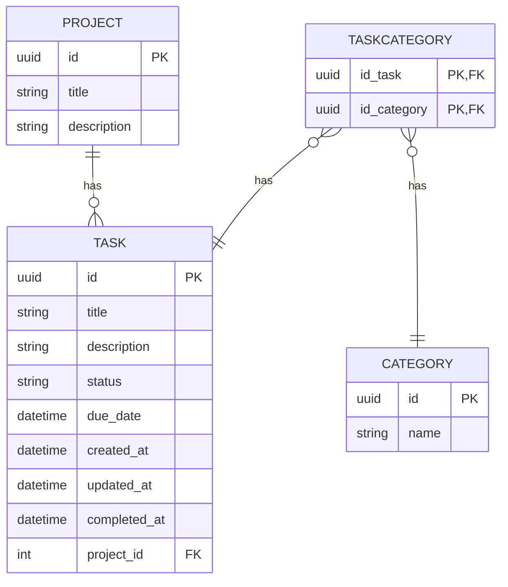

## ERD

```mermaid
erDiagram
    PROJECT ||--o{ TASK : has
    TASKCATEGORY }o--|| CATEGORY : has
    TASKCATEGORY }o--|| TASK : has

    PROJECT {
        uuid id PK
        string title
        string description
    }

    CATEGORY {
        uuid id PK
        string name
    }

    TASK {
        uuid id PK
        string title
        string description
        string status
        datetime due_date
        datetime created_at
        datetime updated_at
        datetime completed_at
        int project_id FK
    }

    TASKCATEGORY {
        uuid id_task PK, FK
        uuid id_category PK, FK
    }
```