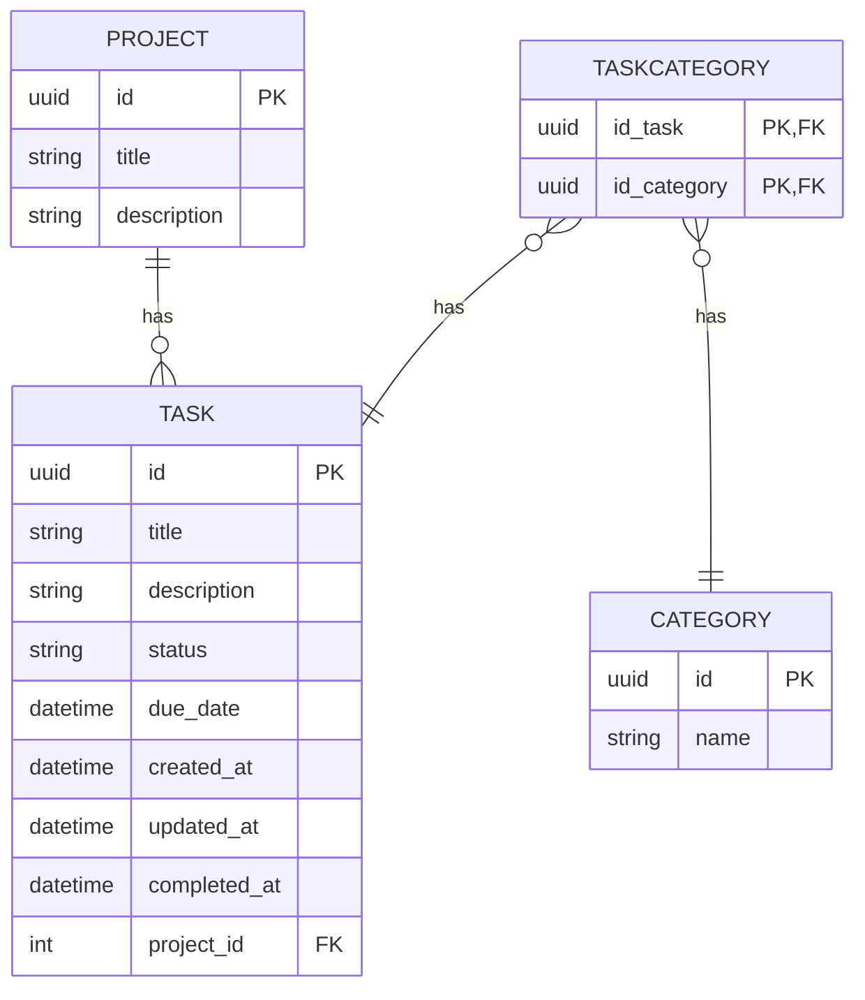

## 🐳 **Como Rodar o Projeto (Docker compose)**

Pré-requisitos:

* Docker
* Docker Compose

### 🔧 **Subir o servidor**

```bash
docker compose up --build
```

>[!IMPORTANT]
> A API ficará disponível em: `http://localhost:8000/api/`

### ▶️ **Rodar migrações**

```bash
docker compose run todo migrate
```
> [!TIP]
> Pode ser criado um superusuário (opcional): `docker compose run todo createsuperuser`


## 🖥️ **Como Rodar o Projeto (sem Docker)**

Pré-requisitos:

* Python 3.13+
* Virtualenv

### Criar e ativar ambiente virtual

```bash
python -m venv venv
source venv/bin/activate   # macOS/Linux
venv\Scripts\activate      # Windows
```

### Instalar dependências

```bash
pip install -r requirements.txt
```

### Aplicar migrações

```bash
python manage.py migrate
```

### Rodar o servidor

```bash
python manage.py runserver
```

>[!IMPORTANT]
> A API ficará disponível em: `http://localhost:8000/api/`


<!-- 
## ERD (Entidade–Relacionamento)


 -->